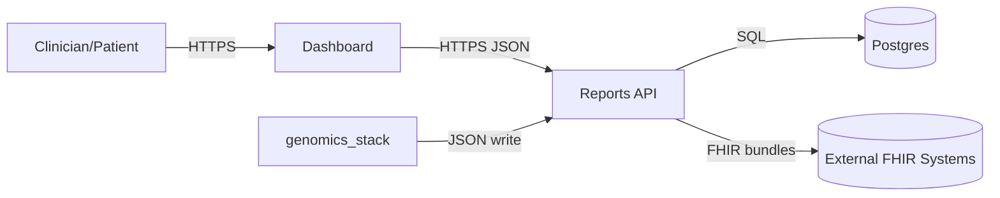

# Threat Model — STRIDE & Data Flow

## Data Flow Diagram

## STRIDE Summary
- **Spoofing**: API tokens; mutual TLS (later); short-lived sessions.
- **Tampering**: Payload SHA-256 at sign-out; DB immutability for signed reports; migrations reviewed.
- **Repudiation**: Audit trail (who signed, when, payload hash); request IDs in logs.
- **Information Disclosure**: PHI redaction in logs; least privilege DB roles; scoped API tokens.
- **Denial of Service**: Rate limits on API; render timeout; basic caching.
- **Elevation of Privilege**: Role-based endpoints; separate service accounts for pipelines vs dashboard.

## Security Controls (minimum)
- HTTPS everywhere; HSTS; secure cookies if applicable.
- Rotate credentials/secrets; restrict DB network access.
- Staging uses synthetic data only.
